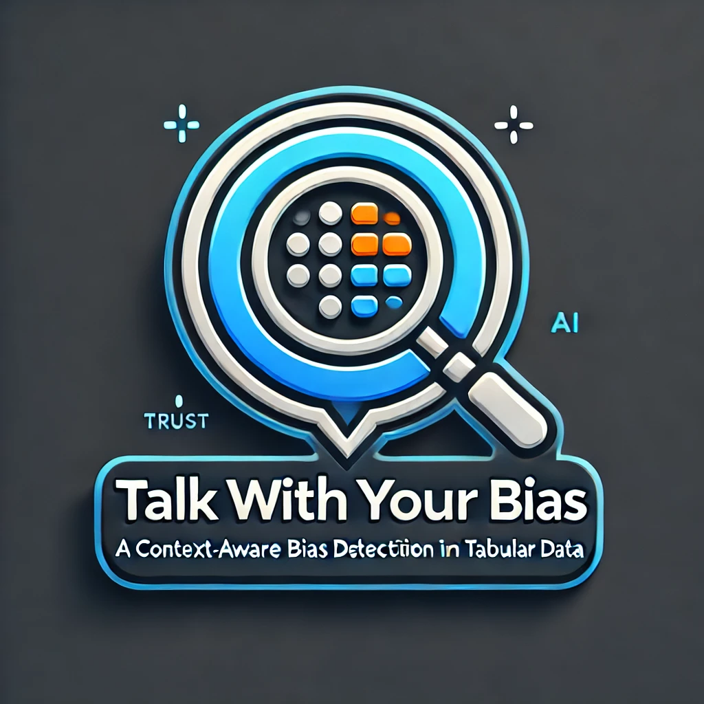

# Talk with Your Bias  

  

## Welcome to Talk with Your Bias! 🎭  
**Context-Aware Agent for Bias Detection and Generation in Tabular Data**  

**Author:** Oleksandr Bezrukov
**Supervisor:** Patrizio Pelliccione
**Paper:** *Talk with Your Bias: A Context-Aware Agent for Bias Detection and Generation in Tabular Data*  

---

## 📌 About the Project  

**Talk with Your Bias** is a framework designed to analyze, measure, and generate bias in tabular datasets.  
It allows users to:  
- Upload their own datasets or generate synthetic data with controlled bias.  
- Explore fairness metrics and bias-related concerns interactively.  
- Gain insights through explanations on bias types, protected attributes, and their impact.  

---

## 🚀 Features  

🔍 **Bias Detection**  
- Identify and quantify bias using fairness metrics and custom measures.  

💡 **Interactive Explanations**  
- Understand bias implications with context-aware insights.  

📊 **Controlled Bias Generation**  
- Create datasets with specific biases for testing and AI fairness evaluation.  

---

## 🏗️ Workflow Overview  

The **Talk with Your Bias** framework facilitates structured discussions on bias-related concerns. You can explore bias concerns freely, but structured steps ensure meaningful analysis.  

### General Steps:  

1️⃣ **Select a Critical Domain**  
- Define the domain to analyze or inject bias into.  

2️⃣ **Prepare Your Dataset**  
- **Upload Your Own Dataset** (CSV format).  
- **Use an Existing Biased Dataset** from predefined sources.  
- **Generate a Custom Dataset** with specific bias settings.  

3️⃣ **Start Talking About Your Bias**  
- Engage in discussions and analyses regarding dataset bias.  

4️⃣ **Bias Analysis & Injection**  
- Detect, measure, and visualize biases.  
- Inject controlled bias for research and stress testing.  

5️⃣ **Visualization of Bias**  
- Use visualization tools for intuitive insights.  

📌 **Key Notes:**  
- Steps are flexible, but **bias analysis requires a selected domain**.  
- **Visualization should follow bias analysis** for meaningful interpretation. 

📂 **Knowledge Database & SOTA Datasets**  
- **Knowledge database tables** are located in the `knowledge_db_files` directory, where you can find a `README.md` explaining their structure.  
- **SOTA (State-of-the-Art) tabular datasets** are categorized by critical domains and stored in the `sota_tabular_datasets` directory.

---

## Prerequisites

To run the app, you will need:
- Python 3.7+
- Streamlit installed
  ```bash
  pip install streamlit
  ```
  
### Running the App

You can run the app from the command line.

### Example Usage:
  ```bash
  streamlit run talk_with_your_bias.py --server.port=8501 
  ```
